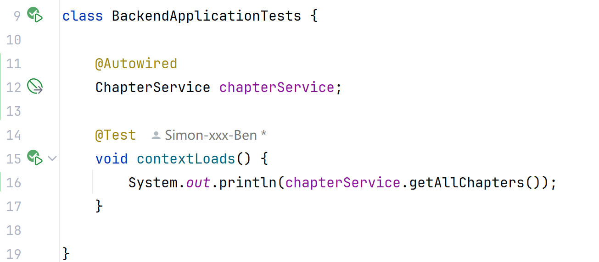
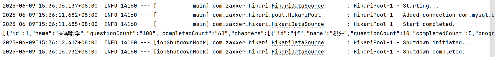

### 获取所有章节信息

函数位置【`service.impl.chapter.ChapterServiceImpl.getAllChapters()`】

目的：【无参获取全部章节信息】

输入参数：【写参数名和类型，无则写无】

输出结果：序列化后的字符串，如【`JSON.toJSONString(List<JSONObject>)`】，其中【`List<JSONObject>`】为所有练习章节信息的列表【`practice_list`】

测试用例：

| 编号 | 标题          | 预期结果                     | 实际结果                     | 状态 |
| ---- | ------------- | ---------------------------- | ---------------------------- | ---- |
| T1   | 给【`参数1`】 | 返回正确结果：【具体返回值】 | 返回正确结果：【具体返回值】 | 成功 |
| T2   | 给【`参数2`】 | 返回错误结果：【具体返回值】 | 返回错误结果：【具体返回值】 | 成功 |
| ···  | ······        | ······                       | ······                       | ···  |

无参则如下

| 编号 | 标题     | 预期结果       | 实际结果       | 状态 |
| ---- | -------- | -------------- | -------------- | ---- |
| T1   | 无参函数 | 【具体返回值】 | 【具体返回值】 | 成功 |

测试步骤：

1. 在`Tests`类中使用`@Autowird`注入【`ChapterServiceImpl`】实现类
2. （无参则不写）在`contextLoads()`函数中定义参数【`参数1`】、【`参数2`】······
3. （无参则不写）向函数传入参数
4. 在`contextLoads()`函数中调用函数并使用【`System.out.println(chapterService.getAllChapters())`】通过控制台输出结果
5. 运行测试

测试代码截图：（实例）

输出结果：（实例）截出所有用例的输出结果

### 分类获取所有试卷信息

函数位置【`service.impl.exams.ExamsServiceImpl.getAllExamsClassification()`】

之后与上述类似

### 根据id提交考试答案并判断正误

函数位置【`service.impl.exams.ExamsServiceImpl.setExamScoreById()`】

输入参数：考试ID`int id`和`JSONObject jsonObject`，其中，`jsonObject`存有分数`score`字段

输出结果：`JSONObject`对象，其中存有`is_successful`和`error_message`两个字段

> 【用例编写参考】
>
> 已完成的异常数据捕捉：
>
> 1. 参数是否存有`id`字段
> 2. 参数`id`字段是否能够转为`Integer`
> 3. 数据库中是否存在该`id`的数据项

之后与上述类似

### 根据id获取题目信息

函数位置【`service.impl.questions.QuestionsServiceImpl.getQuestionById()`】

输入参数：题目ID`int id`

输出结果：序列化后的字符串，存有某个考试的全部信息

之后与上述类似

> 【用例编写参考】
>
> 已完成的异常数据捕捉：
>
> 1. 参数是否存有`id`字段
> 2. 参数`id`字段是否能够转为`Integer`
> 3. 数据库中是否存在该`id`的数据项

### 获取包含全部错题的列表

函数位置【`service.impl.questions.QuestionsServiceImpl.getWrongQuestionsList()`】

输入参数：分页查询，页号`int page`、页大小`int limit`

输出结果：序列化后的字符串，如`JSON.toJSONString(wrongQuestionsList)`，存有错题列表，每一个列表项为一个完整的题目信息

之后与上述类似

> 【用例编写参考】
>
> 已完成的异常数据捕捉：
>
> 1. 不存在page参数
> 2. 不存在limit参数
> 3. 参数page不可转为int（字符（串）、double等）
> 4. 参数limit不可转为int（字符（串）、double等）

### 根据id删除指定题目

暂时不写，先跳过

### 推荐某个id相关的题目列表

函数位置【`service.impl.questions.QuestionsServiceImpl.getWrongQuestionsByQuestionIdThroughAI()`】

输入参数：题目ID`int id`

输出结果：序列化后的字符串，如`List<INteger>.toString`

之后与上述类似

>【用例编写参考】
>
>仅编写int类型数据，暂不写字符、double等非int类型的数据用例
>
>数值范围超出2-31的int类型的id会被捕捉，返回空列表，其他异常捕捉暂未实现
>
>**现已实现非int类型数据的捕捉（字符（串）、double类型）**

### 能力成长曲线图

函数位置【`service.impl.questions.QuestionsServiceImpl.getChartOfGrowingCapacityThroughAI()`】

输入参数：无

输出参数：字符串，若正确返回则是以`https://mdn.alipayobjects.com/`开头的字符串，否则为空字符串

### 章节掌握度图

`@GetMapping("chart/mastery-degree")`

输入参数：无

输出参数：字符串，若正确返回则是以`https://mdn.alipayobjects.com/`开头的字符串，否则为空字符串